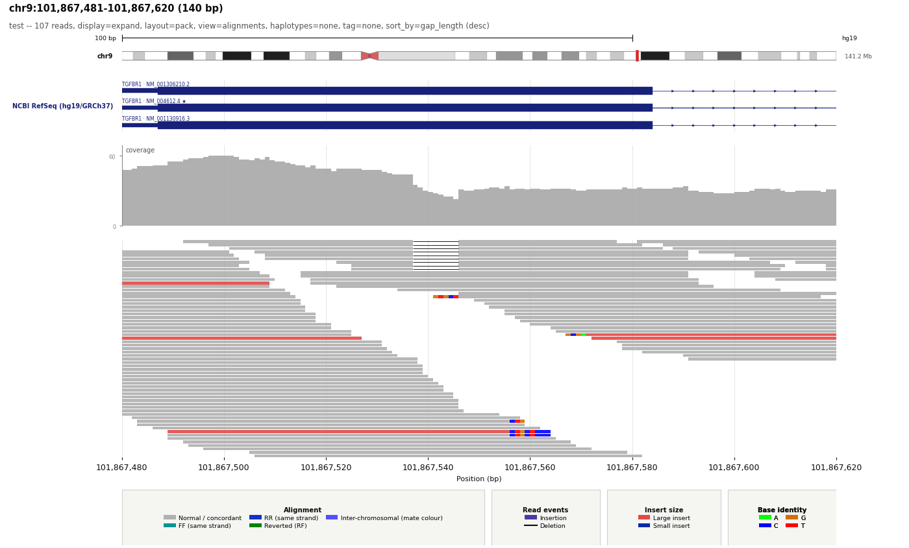
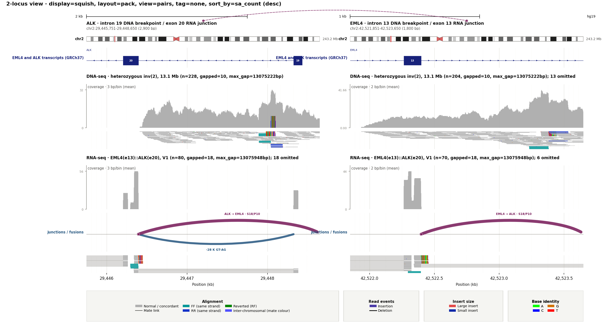
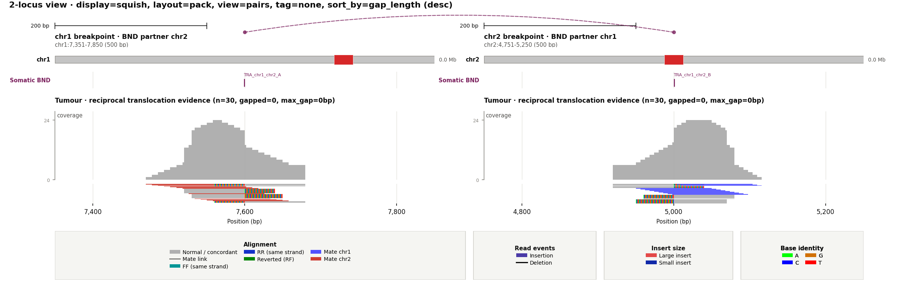
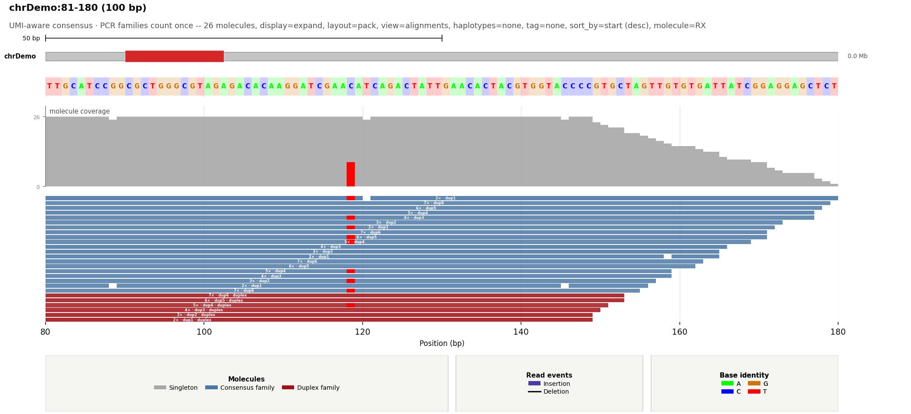
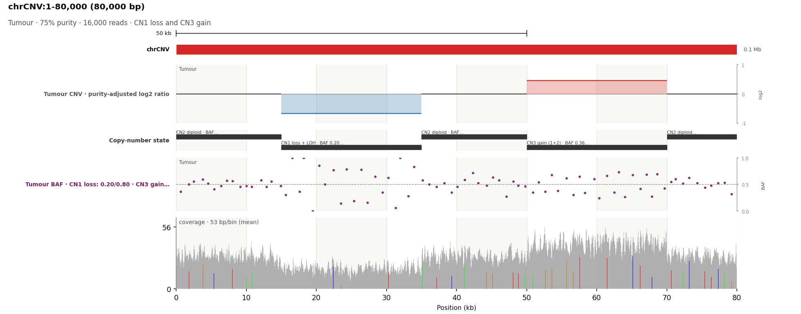
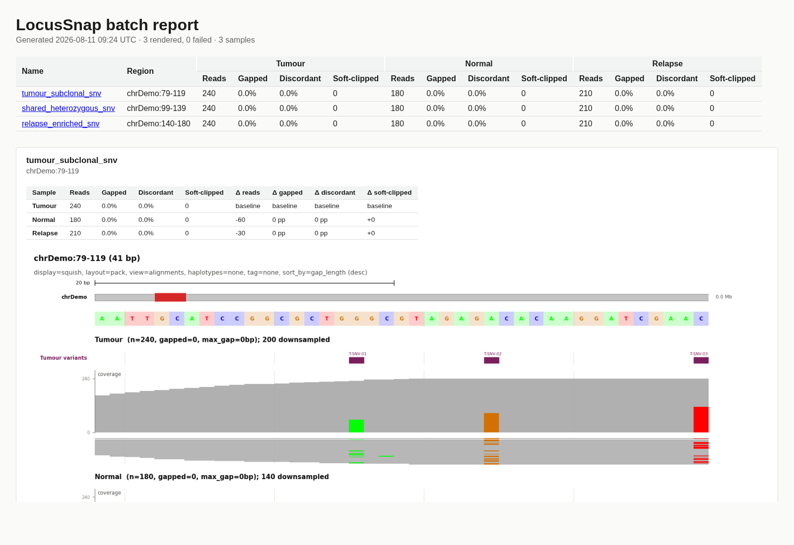
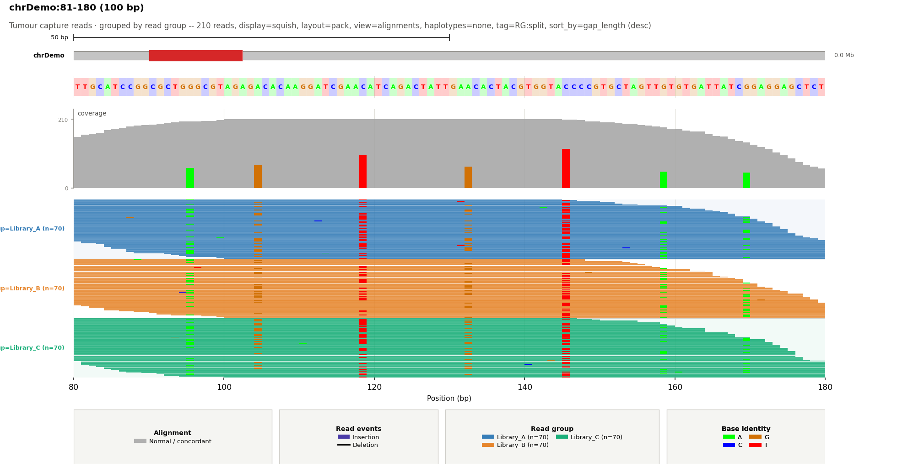
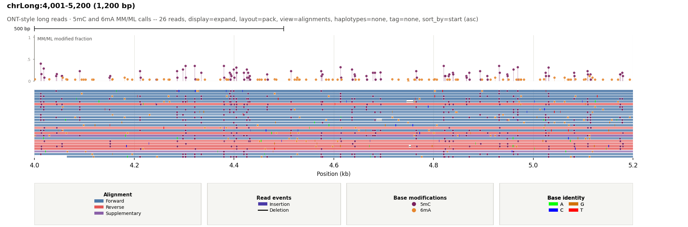
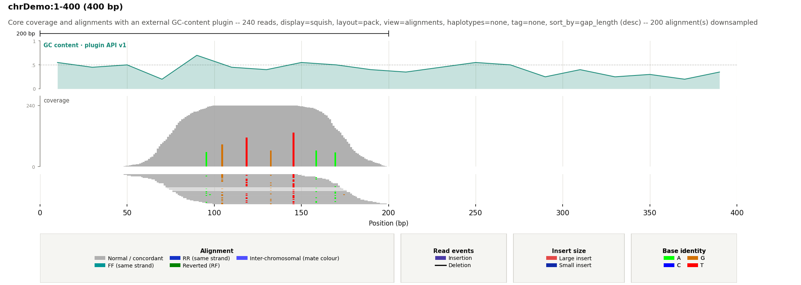
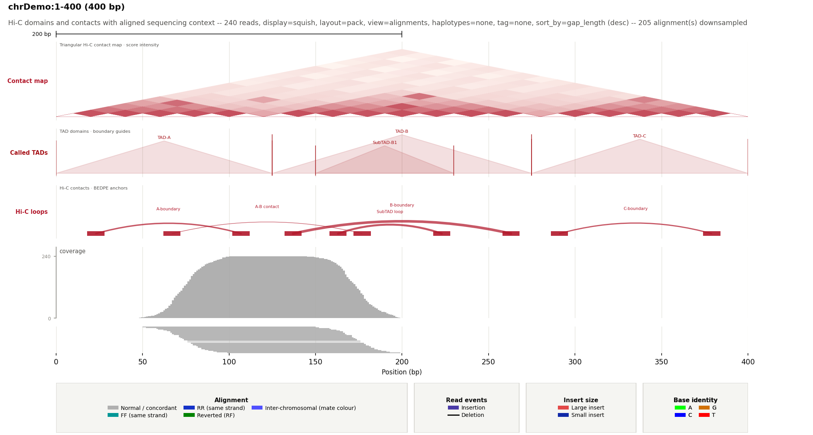

# LocusSnap

[](https://github.com/GENCARDIO/LocusSnap/actions/workflows/ci.yml)

Create an IGV-like image from an indexed BAM without opening a genome browser.

## Documentation

| Guide | Use it for |
| --- | --- |
| [Getting started](https://gencardio.github.io/LocusSnap/getting-started.html) | installation, input preparation, and the first snapshot |
| [Workflow guides](https://gencardio.github.io/LocusSnap/workflows.html) | variants, breakpoints, RNA-seq, long reads, UMI molecules, cohorts, and Hi-C |
| [Recipes](https://gencardio.github.io/LocusSnap/recipes.html) | copyable commands for routine plotting tasks |
| [Configuration](https://gencardio.github.io/LocusSnap/configuration.html) | YAML presets, colours, tracks, grids, highlights, and plugins |
| [Reference](https://gencardio.github.io/LocusSnap/reference.html) | CLI groups, file formats, exports, and Python API |
| [Gallery](https://gencardio.github.io/LocusSnap/gallery.html) | the ten representative figures and their reproducible sources |
| [FAQ](https://gencardio.github.io/LocusSnap/faq.html) | indexes, CRAM, reference compatibility, performance, and troubleshooting |

## Install

```bash
pip install locus-snap
```

This installs the `locus-snap` command and the `locus_snap` package.

## Basic usage

```bash
locus-snap \
  --bam sample.bam \
  --region chr9:101867481-101867620 \
  --output_dir out \
  --output_name locus
```

The result is `out/locus.png`.

### Run from a source checkout

```bash
git clone https://github.com/GENCARDIO/LocusSnap.git
cd LocusSnap
pip3 install -e .

python3 locus_snap.py \
  --bam sample.bam \
  --region chr9:101867481-101867620 \
  --output_dir out \
  --output_name locus
```

`python3 -m locus_snap ...` is equivalent when running from the repository.

The input can be BAM or CRAM and must be indexed. If it is not:

```bash
samtools index sample.bam    # produces sample.bam.bai
samtools index sample.cram   # produces sample.cram.crai
```

CRAM additionally requires `--fasta`, since decoding CRAM reads needs the same
reference the file was compressed against.

Regions are **1-based and inclusive**. Add `--flank 500` to show 500 bp on
each side.

For human BAMs, the first run may download and index the matching NCBI RefSeq
gene annotation. Use `--refseq none` if you want the image immediately without
that track.

## Examples

Ten representative previews are shown below. Click any preview for the
full-resolution figure.

<table>
  <tr>
    <td width="50%">
      <a href="out/30_default_refseq_isoforms.png"></a><br>
      <strong>Default genomic snapshot</strong><br>
      <sub>Ideogram, RefSeq isoforms, coverage, alignments, and grouped legend.</sub>
    </td>
    <td width="50%">
      <a href="out/41_rnaseq_junction_fusion.png"></a><br>
      <strong>EML4::ALK across DNA and RNA</strong><br>
      <sub>A 13.1 Mb inv(2) with FF/RR and split-read DNA support, alongside the expressed EML4(e13)::ALK(e20) V1 junction.</sub>
    </td>
  </tr>
  <tr>
    <td width="50%">
      <a href="out/34_explicit_multilocus_breakpoint.png"></a><br>
      <strong>Explicit multi-locus breakpoint view</strong><br>
      <sub>Independently scaled loci align reciprocal pairs, split reads, soft clips, coverage, and VCF breakends.</sub>
    </td>
    <td width="50%">
      <a href="out/40_molecule_consensus.png"></a><br>
      <strong>UMI molecule consensus</strong><br>
      <sub>PCR families collapse to one consensus unit for layout, coverage, and allele fractions.</sub>
    </td>
  </tr>
  <tr>
    <td width="50%">
      <a href="out/18_variant_evidence_baf_loh.png"></a><br>
      <strong>CNV with BAF/LOH and genomic bands</strong><br>
      <sub>Depth, copy-number segments, and BAF shifts distinguish loss/LOH from copy-number gain.</sub>
    </td>
    <td width="50%">
      <a href="out/35_multi_sample_batch_report.png"></a><br>
      <strong>Multi-sample batch report</strong><br>
      <sub>BED/VCF candidates become a self-contained review with shared-scale sample panels and comparison metrics.</sub>
    </td>
  </tr>
  <tr>
    <td width="50%">
      <a href="out/36_tag_grouped_reads.png"></a><br>
      <strong>Group and colour reads by BAM tag</strong><br>
      <sub>RG, CB, or other SAM-tag values form labelled lanes with deterministic or user-defined colours.</sub>
    </td>
    <td width="50%">
      <a href="out/37_long_read_modifications.png"></a><br>
      <strong>Long reads and base modifications</strong><br>
      <sub>Strand-aware long reads retain CIGAR events while MM/ML calls appear per read and as aggregate fractions.</sub>
    </td>
  </tr>
  <tr>
    <td width="50%">
      <a href="out/38_custom_track_plugin.png"></a><br>
      <strong>Custom track plugin API</strong><br>
      <sub>An external API-v1 plugin draws GC content while LocusSnap manages layout, grids, labels, and export.</sub>
    </td>
    <td width="50%">
      <a href="out/39_hic_tads_loops.png"></a><br>
      <strong>Hi-C contact maps, TADs, and loops</strong><br>
      <sub>A red-white triangular contact map accompanies domain boundaries and score-scaled BEDPE arcs.</sub>
    </td>
  </tr>
</table>

The synthetic examples use expanded, deterministic datasets: 240 tumour, 180
normal, 210 relapse, 300 METex14 RNA alignments, 150 EML4::ALK RNA alignments,
582 matched EML4::ALK inversion DNA alignments, 703 structural-variant
alignments, and 16,000 reads across a purity-aware CNV locus; 12 general VCF
records; 26 positional UMI families; 83 heterozygous BAF loci; 12 H3K27ac,
7 H3K27me3, and 24 DNase peaks;
and three 4 kb normalized CTCF signal profiles. DNA cohorts include a sparse
0.15% low-quality substitution-error model. The CNV cohort couples read depth,
SEG log2 ratios, and BAF bands for diploid, single-copy-loss/LOH, and three-copy
gain states. Rendered figures remain directly under `out/`; their generated
inputs are grouped by type:

```text
out/demo_data/
├── alignments/   # BAM and BAI
├── annotations/  # BED, GTF, SEG, and peak calls
├── config/       # Example YAML themes
├── reference/    # FASTA and FAI
├── signals/      # Quantitative signal tracks and indexes
└── variants/     # VCF and tabix indexes
```

Rebuild the demo inputs, indexes, and curated figure set with:

```bash
bash regenerate_demo_examples.sh
```

## What you get by default

- chromosome ideogram with the current window marked in red
- RefSeq isoforms for recognized hg19/GRCh37 and hg38/GRCh38 BAMs
- Coverage and packed read alignments
- Automatic alignment downsampling above 100× depth
- Discordant-pair, indel, mismatch, and soft-clip colours


Add `--fasta reference.fa` to enable reference bases, mismatch detection, and
SNV allele fractions in coverage. A missing FASTA index is created when
possible.

## Pick the view you need

| Goal | Add these options |
|---|---|
| Normal IGV-like view | `--display_mode expand --layout pack` |
| Very deep region | `--display_mode squish --layout pack` |
| Overlay everything | `--display_mode collapse` |
| One sorted read per row | `--layout expand --sort_by gap_length` |
| Count positional UMI families | `--molecule_mode --molecule_tag auto` |
| Classify RNA junctions and fusions | `--rna_mode --junction_labels full` |
| Link visible mates | `--view_as_pairs` |
| Two loci: region + inferred mate locus | `--mate_view` |
| Only event-supporting reads | `--only discordant gapped split softclip` |
| Hide the legend | `--no_legend` |
| Hide the background grid | `--grid_mode none` |
| Add coordinate subdivisions | `--grid_mode major_minor` |
| Use alternating genomic bands | `--grid_mode bands` |
| Highlight a genomic interval | `--highlight chr1:100100-100250 --highlight_color '#ffd54f'` |
| Center the figure title | `--title_align center` |
| Hide coverage | `--no_coverage` |
| Hide chromosome overview | `--no_ideogram` |
| Add a center guide | `--center_guide` |

`display_mode` controls read height. `layout` controls row placement. They are
independent.

`--grid_mode` controls the genomic background consistently across alignment,
coverage, annotation, multi-sample, and mate-window panels. The default is
`major`. Grid colours, line styles, opacity, widths, band opacity, and the
number of minor subdivisions can all be adjusted under `visual_colors` and
`styles` in the YAML configuration.

Use repeatable `--highlight chrom:start-end` intervals to shade selected loci
through every data track. `--highlight_color` accepts Matplotlib colours and
`--highlight_alpha` controls their shared opacity. Highlights also work in
multi-sample and mate-window figures; in mate view, each interval is applied
only to the panel with the matching chromosome.

`--title_align left|center|right` positions the complete figure heading block,
including its subtitle. It applies consistently to single-locus, multi-sample,
and mate-window figures without moving individual track or panel labels.

## Common recipes

### Small window with reference bases

Reference bases are shown automatically for windows up to 250 bp.

```bash
locus-snap \
  --bam sample.bam \
  --fasta reference.fa \
  --region chr1:100001-100140 \
  --output_name base-detail
```

Change the limit with `--max_reference_span BP`; use `0` to hide the reference
row while keeping FASTA-backed mismatch detection.

### High-depth region

```bash
locus-snap \
  --bam deep.bam \
  --region chr1:100000-110000 \
  --display_mode squish \
  --layout pack \
  --max_alignment_depth 100 \
  --output_name deep-region
```

Coverage still uses all filtered reads. Only the displayed alignment track is
downsampled. Use `--max_alignment_depth 0` to disable downsampling or
`--max_rows N` to impose a hard row limit.

### View paired alignments

```bash
locus-snap \
  --bam sample.bam \
  --region chr9:101867481-101867620 \
  --view_as_pairs \
  --display_mode squish \
  --output_name paired-reads
```

Visible primary mates share a row and are connected. Off-window,
inter-chromosomal, supplementary, and incomplete pairs remain individual
alignments.

### Two-panel breakpoint or translocation view

```bash
locus-snap \
  --bam tumour.bam \
  --region chr3:187721000-187721500 \
  --mate_view \
  --mate_window_source discordant \
  --only discordant \
  --output_name breakpoint
```

`--mate_window_source` accepts:

- `discordant`: mapped mate positions from discordant pairs;
- `split`: supplementary positions from SA tags;
- `softclip`: mapped mates of soft-clipped reads.

Candidates are grouped by chromosome. The busiest chromosome is selected and
the panel is centered on the mean candidate position. Set its width with
`--mate_window_size BP`. Mate view currently accepts one BAM.

### Explicit multi-locus breakpoint view

Repeat `--region` to place two or more independently scaled loci in adjacent
columns. Repeat `--region_label` for descriptive panel headings and add
`--link_breakpoints` to connect the centre of each neighbouring locus:

```bash
locus-snap \
  --bam tumour.bam \
  --region chr3:187721000-187721500 \
  --region chr8:128747000-128747500 \
  --region_label 'Primary breakpoint' \
  --region_label 'Partner breakpoint' \
  --link_breakpoints \
  --view_as_pairs \
  --output_name explicit-breakpoints
```

Each column has its own coordinate ticks, scale ruler, reference bases,
ideogram marker, highlights, and annotation fetch. Repeated `--bam` inputs are
stacked within every locus, so the same layout supports tumour/normal or
longitudinal comparisons. With `--sort_by base`, each locus sorts at its own
centre. An explicit `--sort_base_position` and metrics TSV export are not yet
supported when more than one region is supplied.

### Sort reads carrying an SNV

```bash
locus-snap \
  --bam sample.bam \
  --fasta reference.fa \
  --region chr9:101867520-101867570 \
  --layout expand \
  --sort_by base \
  --sort_base_position 101867542 \
  --output_name snv-sort
```

Alternative A/C/G/T alleles are placed first, followed by the reference,
deletions, skips, and reads that do not cover the position. Without a FASTA,
the most frequent observed base is used as the local reference.

### Show SNV allele fractions in coverage

```bash
locus-snap \
  --bam sample.bam \
  --fasta reference.fa \
  --region chr1:100001-100140 \
  --coverage_vaf_threshold 0.10 \
  --min_baseq 20 \
  --min_variant_mapq 20 \
  --show_variant_counts \
  --output_name vaf
```

The default threshold is VAF > 0.20. Only SNVs are included. Labels show
ALT/depth, VAF, strand counts, mean base quality, and mean MAPQ when there is
enough room.

### Haplotype-aware view

```bash
locus-snap \
  --bam phased.bam \
  --region chr1:100001-100500 \
  --haplotype_view split \
  --haplotype_filter 1 2 untagged \
  --output_name haplotypes
```

`color` colours reads by the `HP` tag. `split` also creates HP lanes and shows
phase-set information from `PS`. Override the tags with `--haplotype_tag` and
`--phase_set_tag`.

Phased sample genotypes in a VCF track are also haplotype-aware. For example,
`GT:PS=1|0:42524947` labels and colours the alternate allele as `HP1`, matching
reads with `HP:i:1` and the same phase set. The deterministic
[CYP2D6*4.001/*1 example](out/42_cyp2d6_star4_haplotype.png) combines five
non-reference markers from the legacy *4A/*4.001 definition on GRCh37, a
numbered canonical transcript, paired reads, coverage, and HP1/HP2 lanes.
When an indexed hg19 FASTA and both `wgsim` and `bwa` are available, the
generator simulates two 15× haplotypes and maps the resulting 2×150 bp reads
to the complete genome. MAPQ 0 primary alignments are retained, so paralogous
CYP2D6/CYP2D7 sequence produces the expected uneven coverage and pale
low-confidence reads. Point to a non-standard reference location with
`LOCUSSNAP_HG19_FASTA`:

```bash
export LOCUSSNAP_HG19_FASTA=/path/to/ucsc.hg19.fasta
python3 generate_demo_data.py
bash regenerate_demo_examples.sh
```

### Group and colour reads by any BAM tag

Separate reads into lanes by a scalar SAM tag such as read group (`RG`), cell
barcode (`CB`), or a caller-specific support tag:

```bash
locus-snap \
  --bam tumour.bam \
  --region chr1:100001-100500 \
  --group_by_tag RG \
  --tag_label 'Read group' \
  --tag_color 'Library_A=#377eb8' \
  --tag_color 'Library_B=#e6862d' \
  --tag_filter Library_A Library_B untagged \
  --output_name libraries
```

`--group_by_tag` both colours and separates values into labelled lanes.
`--color_by_tag` applies the same colours without changing row placement.
Values without an explicit `--tag_color` receive stable palette colours, and
reads missing the selected tag become `untagged`. The legend lists up to eight
entries and summarizes additional high-cardinality values, so tags such as
`CB` do not create an unbounded legend. Use `--tag_filter` when only selected
barcodes or categories should be shown. Generic tag views and
`--haplotype_view` are mutually exclusive because both control read colour.

### UMI molecule consensus

Collapse PCR-family alignments into one positional molecule before layout,
coverage, VAF, summaries, or TSV export:

```bash
locus-snap \
  --bam umi-tagged.bam \
  --fasta reference.fa \
  --region chr1:100001-100200 \
  --molecule_mode \
  --molecule_tag auto \
  --min_family_size 2 \
  --molecule_position_tolerance 2 \
  --molecule_consensus_fraction 0.60 \
  --output_name molecule-consensus
```

`auto` selects the best-covered standard molecule tag in `MI`, `RX`, and
`UB` order; choose one explicitly when the BAM carries several. Families are
separated by tag value, optional `CB` cell barcode, chromosome, read side, and
similar alignment start/end coordinates. This prevents a reused UMI in a
different cell or distant fragment from being merged. Duplicate-flagged reads
are retained automatically inside molecule families, then each family is
replaced by a quality-aware majority consensus. `--min_family_size 1` keeps
true singletons; use `2` or more to require replicated evidence.

The read label reports family size (`4×`), duplicate members (`dup3`), and
duplex status when both alignment strands support a family. Grey denotes a
singleton, blue a multi-read consensus, and dark red a duplex family. Coverage
and alternative-allele counts are molecule-level, so PCR amplification cannot
inflate depth or VAF. Molecule mode currently does not combine with paired,
mate-window, long-read, MM/ML base-modification, haplotype-colour, or generic
tag-colour/group views.

### Long-read mode and base modifications

Use the ONT/PacBio preset on a BAM carrying standard `MM`/`ML` tags:

```bash
locus-snap \
  --bam nanopore.bam \
  --fasta reference.fa \
  --region chr1:100001-105000 \
  --long_read_mode \
  --min_mod_probability 0.70 \
  --output_name long_reads
```

Long-read mode colours primary alignments by forward/reverse strand and gives
supplementary alignments a separate colour. It also enables base-modification
display when tags are present. At close zoom, confident calls are overlaid on
the read body; an additional track reports the fraction of canonical-base
depth carrying a call above the probability threshold. No empty modification
track is added when the BAM has no calls.

Use `--base_modifications` without the preset to keep ordinary alignment
colours. Repeat `--modification_code` to restrict the view; SAM codes (`m`,
`h`, `a`), canonical forms (`C+m`), and labels (`5mC`, `5hmC`, `6mA`) are
accepted. `--long_read_mode` defaults to squish display unless an explicit CLI
or YAML `display_mode` is supplied.

### RNA-seq junction and fusion analysis

The original sashimi view remains available for a simple count-only plot:

```bash
locus-snap \
  --bam rnaseq.bam \
  --region chr1:100000-110000 \
  --sashimi \
  --min_junction_reads 3 \
  --sashimi_strand split \
  --display_mode squish \
  --output_name sashimi
```

Junctions come from CIGAR `N` operations. Arc labels are supporting-read
counts. `combined` merges strands; `split` mirrors plus and minus junctions.

For richer RNA review, enable the RNA preset. It combines the sashimi track
with candidate fusion evidence from `SA` split alignments and distant or
inter-chromosomal mates:

```bash
locus-snap \
  --bam tumour-rna.bam \
  --fasta reference.fa \
  --region chr2:42490000-42530000 \
  --track transcripts.gtf.gz \
  --rna_mode \
  --min_junction_reads 3 \
  --min_junction_anchor 12 \
  --sashimi_strand split \
  --rna_strandness reverse \
  --junction_labels full \
  --min_fusion_reads 3 \
  --fusion_breakpoint_tolerance 10 \
  --fusion_min_distance 100000 \
  --rna_evidence_tsv rna-evidence.tsv \
  --output_name rna-evidence
```

Junction support is deduplicated by query name. `--min_junction_anchor`
requires matched sequence on both sides of the intron, helping suppress
short-anchor alignments. Visible BED12/GFF/GTF transcript models classify
exact exon boundaries as annotated (`K`, solid blue); unmatched boundaries
are novel (`N`, dashed orange). With FASTA, `--junction_labels full` also
reports strand-oriented motifs such as `GT-AG`, `GC-AG`, or `AT-AC` and marks
non-canonical motifs in dark red.

`--rna_strandness forward|reverse` normalizes paired-end read orientation to
the inferred transcript strand; `alignment` preserves raw BAM orientation and
is the backward-compatible default. Fusion arcs cluster nearby local and
partner breakpoints, deduplicate query names, and label split/spanning support
as `S#/P#`. Same-chromosome chimeras closer than `--fusion_min_distance` are
ignored. Use `--rna_fusions` instead of `--rna_mode` when only fusion evidence
is wanted. The optional TSV contains stable one-row summaries for both
junctions and fusion candidates and currently supports one BAM and one region.

The maintained fusion example stacks matched DNA-seq and RNA-seq at both
breakpoints. Its DNA panel models the chromosome-2 inversion with same-strand
discordant pairs and reciprocal `SA` alignments; its RNA panel places the
mature junction at EML4 exon 13 and ALK exon 20. Run
`./regenerate_demo_examples.sh` to rebuild
[`out/41_rnaseq_junction_fusion.png`](out/41_rnaseq_junction_fusion.png) and
the deterministic inputs beneath `out/demo_data/`.
The reproduction command uses `--rna_sample 2`, so junction/fusion arcs are
reserved for the RNA BAM, and `--show_exon_numbers`, so the GTF-provided exon
numbers appear inside sufficiently wide exon boxes.

### Stack several BAMs and matched VCFs

```bash
locus-snap \
  --bam tumour.bam \
  --bam normal.bam \
  --bam relapse.bam \
  --sample_label Tumour \
  --sample_label Normal \
  --sample_label Relapse \
  --vcf_companion tumour.vcf.gz \
  --vcf_companion none \
  --vcf_companion relapse.vcf.gz \
  --region chr9:101867492-101867612 \
  --output_name multi-sample
```

Repeat labels and companion VCFs in BAM order. Use `none` when a sample has no
VCF. Each BAM keeps its own coverage, alignments, downsampling, and summary.

### Batch rendering and reports

Render every region in a BED file with one command. Repeat `--bam` to make
every output image a stacked, multi-sample comparison:

```text
# candidates.bed  (BED3/BED4: chrom, start, end[, name])
chr9	101867480	101867620	MET_ex14
chr1	100000	101000
```

```bash
locus-snap \
  --bam tumour.bam \
  --bam normal.bam \
  --bam relapse.bam \
  --sample_label Tumour \
  --sample_label Normal \
  --sample_label Relapse \
  --batch_regions candidates.bed \
  --report \
  --threads 4 \
  --output_dir out/candidates
```

Each row renders to its own image, named from the optional 4th BED column (or
`chrom_start_end` when omitted); `--flank`, `--display_mode`, `--track`, and
the usual figure options still apply to every region. Multi-sample coverage
panels share a y-scale within each locus, making depth changes directly
comparable. `--threads N` renders independent regions in isolated worker
processes while preserving BED/VCF order in the report. One bad region (e.g. a
contig missing from a BAM) is logged and skipped rather than aborting the whole
batch; the process exits non-zero if any region failed.

`--batch_regions` also accepts a VCF/VCF.gz/BCF directly (picked by file
extension) — one region per variant record, no BED needed:

```bash
locus-snap \
  --bam sample.bam \
  --batch_regions calls.vcf.gz \
  --flank 50 \
  --report \
  --output_dir out/calls
```

Each region is named from the VCF `ID` column when set (e.g. an rsID),
otherwise `chrom_pos_REF_ALT`. A multi-allelic line still renders as one
region, not one per ALT. The variant span comes from the record's resolved
start/end, so symbolic/structural records with an `INFO/END` (declared as
`Type=Integer` in the VCF header, as any spec-compliant SV caller does) are
handled automatically. **`--flank` matters more here than for BED**: most
variants are point-sized, so `--flank 0` (the default) renders a ~1bp-wide
image — set `--flank` to whatever context you want around each call.
Records with no ALT allele (e.g. gVCF reference blocks) are skipped.

`--report` (optionally `--report NAME.html`) writes one self-contained HTML
file with every rendered image embedded inline, alongside
a grouped summary of reads/gapped%/discordant%/soft-clipped for every sample
and region. Each region card also reports changes versus the first BAM (the
baseline) in reads, gapped and discordant percentage points, and soft-clipped
read count. The report supports tumour/normal and longitudinal review without
opening each image. It requires `--batch_regions` and a browser-viewable
`--output_format` (png, jpg, jpeg, webp, or svg — not pdf/tiff/svgz).

For a reproducible three-sample example, run `python3 generate_demo_data.py`
and use `out/demo_data/annotations/demo_multi_sample_review.bed` with the
demo tumour, normal, and relapse BAMs. `regenerate_demo_examples.sh` writes the
finished report to `out/multi_sample_batch/35_multi_sample_batch_report.html`.

`--batch_regions` does not combine with `--sort_base_position` or
`--metrics_tsv`.

## Add genomic tracks

The short form is enough when the filename identifies the format:

```bash
locus-snap \
  --bam sample.bam \
  --region chr9:101867492-101867612 \
  --track genes.gtf.gz \
  --track variants.vcf.gz \
  --track_label Genes \
  --track_label Variants \
  --output_name annotated
```

For full control, use one quoted CSV value per track:

```text
--custom_track 'FILE,TYPE,NAME,COLOR[,DISPLAY[,HEIGHT_IN]]'
```

Example:

```bash
--custom_track 'regions.bed,bed,Candidates,#000000,collapse,0.30' \
--custom_track 'genes.gtf.gz,gtf,GENCODE,#17217a,expand,0.85' \
--custom_track 'variants.vcf.gz,vcf,Variants,#7a1f5c,collapse,0.25'
```

Quote the entire value so `#` is not treated as a shell comment.

### Supported tracks

| Type | Use for | Default rendering |
|---|---|---|
| BED/BED12 | regions, probes, custom features | black blocks |
| GFF/GFF3/GTF | genes and transcripts | UCSC navy exon/UTR models |
| VCF | SNVs and structural variants | burgundy variant intervals |
| narrowPeak/broadPeak | ChIP-seq, ATAC-seq, DNase-seq | filled signal peaks |
| signal | normalized ChIP/ATAC/DNase pileup | continuous filled profile |
| BigWig | the same, distributed as an indexed binary file | continuous filled profile |
| SEG | segmented copy number | gain/loss log2 track |
| bedGraph/log2/CNV | binned or segmented log2 ratios | signed zero-centered track |
| TAD/domains | called Hi-C domains | translucent domain triangles and boundary guides |
| BEDPE | Hi-C loops and binned contact scores | score-scaled arcs or a triangular contact map |

The accepted custom `TYPE` values are `bed`, `gff`, `gff3`, `gtf`, `vcf`,
`narrowpeak`, `broadpeak`, `peak`, `signal`, `bigwig` (alias `bw`), `seg`,
`bedgraph`, `log2`, `cnv`, `tad`, `bedpe`, and `auto`.

### Hi-C TADs and chromatin loops

LocusSnap accepts processed Hi-C feature calls alongside BAMs and all other
tracks. A `tad` file is BED-like and zero-based: chromosome, start, end, then
optional name and numeric boundary/domain score. Files ending in `.tad`,
`.domains`, `.tad.bed`, or `.domains.bed` are detected automatically.

BEDPE files require the standard first six anchor columns. Optional column 7
supplies the contact name and column 8 its numeric score. Use `arcs` for called
loops: larger scores receive stronger arcs, and a visible inter-chromosomal
anchor is marked with its partner chromosome. Use `triangle` for binned cis
contacts: each scored bin pair becomes a cell in a rotated triangular contact
map. Its default white-to-red intensity scale follows the familiar visual
language of Hi-C maps such as
[Rao et al. (2014)](https://pmc.ncbi.nlm.nih.gov/articles/PMC5635824/).

```bash
locus-snap \
  --bam sample.bam \
  --region chr8:127000000-130000000 \
  --custom_track 'sample.contacts.bedpe,bedpe,Contact map,#b2182b,triangle,1.6' \
  --custom_track 'sample.tad.bed,tad,Called TADs,#a50f15,collapse,1.0' \
  --custom_track 'sample.loops.bedpe,bedpe,Hi-C loops,#b2182b,arcs,1.0' \
  --output_name hic-context
```

The custom-track `COLOR` controls the high-contact end of the map. YAML keys
`track_colors.hic_contact_low`, `styles.hic_contact_gamma`,
`styles.hic_contact_map_alpha`, `styles.hic_contact_cell_edge_width`, and
`styles.hic_track_height_in` control the pale endpoint, intensity response,
opacity, cell borders, and default physical height. TAD and arc colours remain
independently configurable with `track_colors.tad` and
`track_colors.hic_loop`.

Plain text works directly. Large TAD or BEDPE collections can be BGZF-compressed
and indexed on their first interval with `tabix -p bed`; local cis loops are
then fetched by their first anchor. Store reciprocal rows when a compressed
BEDPE should also be discoverable from either side of a trans contact.

This interface renders domain and loop calls derived from Hi-C. Raw `.hic` and
`.cool` contact matrices are not read directly; export TADs to BED-like records
or loops to BEDPE first.

### Custom track plugin API

External packages can add arbitrary quantitative or categorical tracks without
editing LocusSnap. A plugin implements the public API-v1 base class:

```python
from locus_snap import TrackCanvas, TrackPlugin, TrackRegion

class ScoreTrack(TrackPlugin):
    name = "score-track"
    default_label = "Model score"
    default_height_in = 0.9
    default_color = "#188977"

    def fetch(self, region: TrackRegion, options):
        # Return any payload; region coordinates are zero-based, half-open.
        return query_scores(region.chrom, region.start, region.end, options)

    def render(self, canvas: TrackCanvas, payload, region, options):
        canvas.set_y_limits(0, 1)
        canvas.set_y_ticks([0, 0.5, 1], ["0", ".5", "1"])
        canvas.fill_between(payload.positions, payload.values, alpha=0.25)
        canvas.line(payload.positions, payload.values)
```

Register it from the plugin package's `pyproject.toml`:

```toml
[project.entry-points."locus_snap.track_plugins.v1"]
model-score = "my_locus_plugin:ScoreTrack"
```

After installing that package, use the entry-point name and repeat the option
for multiple tracks:

```bash
locus-snap \
  --bam sample.bam \
  --region chr1:100001-101000 \
  --plugin_track model-score sample=tumour smoothing=25 \
    'track_label=Tumour model score' track_height=1.0 'track_color=#188977'
```

`track_label`, `track_height`, and `track_color` are reserved layout options;
every other `KEY=VALUE` is passed to the plugin as a read-only mapping. During
development, an explicit `module:object` target works without packaging:

```bash
--plugin_track my_package.tracks:ScoreTrack sample=tumour
```

The stable `TrackCanvas` supplies `line`, `step`, `fill_between`, `bars`,
`scatter`, `rectangle`, `span`, `horizontal_line`, `text`, and y-axis methods.
It deliberately does not expose Matplotlib axes: LocusSnap continues to own
genomic limits, shared grids, highlights, panel layout, titles, and export.
Fetch and rendering failures include the plugin name and locus. Plugins used
with multi-process `--batch_regions --threads N` should keep their configured
plugin instance picklable.

For programmatic use, pass a configured source directly:

```python
from locus_snap import PluginTrackSource
from locus_snap.snapshot import BamSnapshot

snapshot = BamSnapshot(
    bam="sample.bam", chrom="chr1", start=100_000, end=101_000,
    plugin_tracks=[PluginTrackSource(ScoreTrack(), {"sample": "tumour"})],
)
snapshot.snap()
```

See [`examples/gc_content_plugin.py`](examples/gc_content_plugin.py) for the
complete plugin used by the gallery example.

### BigWig tracks

A `.bw`/`.bigWig` file (the format most ChIP-seq/ATAC-seq/RNA-seq coverage
tracks, e.g. from deepTools or the UCSC/ENCODE archives, are already
distributed as) works with either track form:

```bash
locus-snap \
  --bam sample.bam \
  --region chr9:101867492-101867612 \
  --track coverage.bw \
  --track_label "Input signal" \
  --output_name bigwig-track
```

BigWig is self-indexed, so no separate `.tbi`/`.csi` file is needed. By
default it loads as a `signal` track (continuous, non-negative, scaled by
`styles.signal_y_max` like any other signal track — see "Configure
everything with YAML"). For signed BigWig data (e.g. a log2 ratio track),
override the type explicitly:

```bash
--custom_track 'ratio.bw,log2,Log2 ratio,#2878b5'
```

Use `--track_display` to control annotation density:

| Mode | Result |
|---|---|
| `collapse` | merge transcript isoforms into one model per gene |
| `pack` | preserve models and share non-overlapping rows |
| `expand` | one transcript per row |
| `density` | compact binned feature count |

Gene introns carry strand arrows: right for `+`, left for `-`. Exons are thick;
UTRs are thinner. Use `--primary_isoforms prefer` to select MANE Select,
RefSeq Select, Ensembl canonical, APPRIS principal, or another recognized
primary marker, while keeping all isoforms for genes without a marker. Use
`only` to remove genes without a primary marker; `all` is the default.
Packed and expanded gene models retain both identifiers in gene-first form,
for example `TGFBR1 · NM_004612.4`; collapsed models show the gene name only.

### Compressed tracks must be indexed

Plain-text tracks work directly. A `.gz`, `.bgz`, or `.bgzf` track must be
BGZF-compressed and have a `.tbi` or `.csi` index. It is fetched by region with
tabix; ordinary gzip is not enough. BigWig (`.bw`/`.bigWig`) is a binary,
self-indexed format and is exempt from this — never gzip it, and no separate
index file is needed.

```bash
bgzip genes.gtf
tabix -p gff genes.gtf.gz

bgzip regions.bed
tabix -p bed regions.bed.gz

bgzip variants.vcf
tabix -p vcf variants.vcf.gz

bgzip H3K27ac.narrowPeak
tabix -p bed H3K27ac.narrowPeak.gz
```

### ChIP-seq and accessibility

```bash
locus-snap \
  --bam sample.bam \
  --region chr1:100000-140000 \
  --track H3K27ac.narrowPeak.gz \
  --track_label H3K27ac \
  --custom_track 'H3K27me3.broadPeak,broadpeak,H3K27me3,#d95f02,collapse' \
  --custom_track 'DNase.narrowPeak.gz,narrowpeak,DNase,#2166ac,density' \
  --output_name chromatin
```

Peak-call files remain discrete intervals: height uses `signalValue`, then BED
score, and narrowPeak summits are marked. Four-column `signal` files are drawn
as one continuous filled pileup profile:

```bash
locus-snap \
  --bam sample.bam \
  --region chr1:100000-104000 \
  --custom_track 'control.signal.gz,signal,Control,#00695c,collapse' \
  --custom_track 'knockdown.signal.gz,signal,Knockdown,#22d3a6,collapse' \
  --no_alignments \
  --no_coverage \
  --output_name ctcf-signal
```

Set one shared `styles.signal_y_max` in YAML when comparing normalized samples;
`0` keeps automatic scaling. Use `density` when called intervals would otherwise
overplot.

### Copy number, BAF, and LOH

```bash
locus-snap \
  --bam tumour.bam \
  --region chr9:101000000-102000000 \
  --track tumour.seg \
  --track_label 'Tumour CNV' \
  --baf_vcf germline-snps.vcf.gz \
  --baf_sample Tumour \
  --baf_track_label 'Tumour BAF / LOH' \
  --output_name cnv-baf
```

BAF uses heterozygous biallelic SNVs. It prefers `FORMAT/AD` and falls back to
`FORMAT/AF`. Compressed VCF/BCF files require an index.

## Human references and ideograms

`--genome auto` identifies hg19 or hg38 only from exact chromosome lengths in
the BAM header. The ideogram uses bundled UCSC cytobands and spans the same
width as the genomic plot.

Useful controls:

```text
--genome hg19|grch37|hg38|grch38|none
--cytoband_file custom.cytoBand.txt.gz
--no_ideogram
```

`--refseq auto` similarly selects and caches an indexed NCBI RefSeq track.

```text
--refseq hg19|grch37|hg38|grch38|none
--refseq_dir /shared/refseq-cache
```

Pre-download both supported assemblies with:

```bash
python3 download_refseq.py
```

The fixed sources are NCBI Annotation Release 105.20220307 for
[GRCh37.p13](https://ftp.ncbi.nlm.nih.gov/genomes/all/annotation_releases/9606/105.20220307/GCF_000001405.25_GRCh37.p13/GCF_000001405.25_GRCh37.p13_genomic.gff.gz)
and Annotation Release 110 for
[GRCh38.p14](https://ftp.ncbi.nlm.nih.gov/genomes/all/annotation_releases/9606/110/GCF_000001405.40_GRCh38.p14/GCF_000001405.40_GRCh38.p14_genomic.gff.gz).

## Configure everything with YAML

Pass `--config FILE.yaml`. Command-line options override YAML preferences.

```yaml
preferences:
  display_mode: squish
  max_alignment_depth: 150
  primary_isoforms: prefer
  fig_width: 16
  dpi: 200

alignment_colors:
  normal: "#c8c8c8"
  large_insert: "#d73027"
  small_insert: "#4a3aa7"

track_colors:
  bed: "#000000"
  gene: "#17217a"
  vcf: "#7a1f5c"

styles:
  row_height_in: 0.06
  squish_row_height_in: 0.015
  coverage_track_height_in: 1.40
  annotation_row_height_in: 0.30
  alignment_edge_width: 0.00
  gene_arrow_size: 2.70
  gene_arrow_spacing_px: 24.0
```

See [config.example.yaml](config.example.yaml) for every colour, preference,
height, opacity, line width, legend setting, ideogram colour, and sashimi style.
Unknown keys and invalid values fail early.

Every track height is configurable:

| Track | YAML key |
|---|---|
| Alignments | `row_height_in`, `squish_row_height_in` |
| Coverage | `coverage_track_height_in` |
| Base modifications | `modification_track_height_in` |
| BED/GFF/GTF/VCF | `annotation_row_height_in` |
| CNV | `cnv_track_height_in` |
| BAF/LOH | `baf_track_height_in` |
| Peaks/signal/density | `peak_track_height_in` |
| TADs/Hi-C contact maps/loops | `hic_track_height_in` |
| Sashimi | `sashimi_track_height_in` |
| Reference bases | `reference_height_in` |
| Ideogram | `ideogram_height_in` |

The sixth `--custom_track` CSV field overrides the height for one track.

## Output format and resolution

PNG is the default. Use a filename extension or `--output_format`:

```bash
# Editable vector image
locus-snap \
  --bam sample.bam --region chr1:100000-101000 \
  --output_name locus.svg

# High-resolution PNG
locus-snap \
  --bam sample.bam --region chr1:100000-101000 \
  --output_name locus --output_format png --fig_width 16 --dpi 300
```

Supported formats: PNG, SVG, SVGZ, PDF, JPEG, TIFF, and WebP. Raster width is
`fig_width × dpi`; height adapts to the tracks and read rows.

## Read colours and evidence

| Read appearance | Meaning |
|---|---|
| grey | normal/concordant |
| red | unexpectedly large FR insert |
| dark blue | unexpectedly small FR insert |
| purple | CIGAR insertion marker |
| teal / blue | FF/RR same-strand pair (IGV orientation colours) |
| green | everted RF pair |
| IGV chromosome colour | inter-chromosomal pair, keyed by the mate chromosome |
| lighter fill | lower MAPQ |

The expected insert-size range is estimated from eligible FR pairs in the
window. Disable pair colours with `--no_pair_colors`; disable MAPQ shading with
`--no_mapq_shading`.

CIGAR insertion and deletion lengths are hidden by default. Show them with
`--show_indel_lengths`.

## Options people use most

| Option | Purpose |
|---|---|
| `--bam BAM` | indexed BAM or CRAM input; repeat for multiple samples |
| `--region chr:start-end` | 1-based inclusive window; repeat for explicit multi-locus columns |
| `--region_label LABEL` | label the corresponding repeated region |
| `--link_breakpoints` | connect adjacent multi-locus panel centres |
| `--batch_regions BED\|VCF` | render every region in a BED file, or every variant in a VCF (single BAM) |
| `--report [NAME.html]` | self-contained HTML report for `--batch_regions` |
| `--fasta FASTA` | reference bases, mismatches, and coverage VAF |
| `--flank BP` | add context on both sides |
| `--display_mode collapse\|expand\|squish` | read-track density |
| `--layout pack\|expand` | packed rows or one sorted unit per row |
| `--sort_by KEY` | `base`, `gap_length`, `mapq`, `start`, and more |
| `--only TYPE [...]` | keep discordant, gapped, split, or soft-clipped reads |
| `--no_legend` | hide legend cards and reclaim their space |
| `--grid_mode MODE` | `none`, `major`, `major_minor`, or alternating `bands` |
| `--highlight REGION` | shade a repeatable interval through every data track |
| `--highlight_color COLOR` | colour shared by highlighted intervals |
| `--highlight_alpha A` | highlight opacity in the range `(0, 1]` |
| `--title_align ALIGN` | place the figure title at `left`, `center`, or `right` |
| `--min_mapq N` | filter low-MAPQ reads |
| `--max_alignment_depth N` | downsample displayed reads above N×; default 100 |
| `--view_as_pairs` | link visible primary mates |
| `--mate_view` | add an inferred mate-locus panel |
| `--group_by_tag TAG` | colour and separate reads into labelled BAM-tag lanes |
| `--color_by_tag TAG` | colour reads by a BAM tag without changing row placement |
| `--tag_filter VALUE [...]` | retain selected tag values, including `untagged` |
| `--tag_color VALUE=COLOR` | override a tag value colour; repeatable |
| `--molecule_mode` | collapse positional MI/RX/UB families into consensus molecules |
| `--molecule_tag TAG` | use `auto`, `MI`, `RX`, or `UB` as the molecule identifier |
| `--min_family_size N` | require at least N alignments in a molecule family |
| `--molecule_position_tolerance BP` | allowed start/end difference within a family |
| `--molecule_consensus_fraction F` | minimum majority fraction for a consensus call |
| `--long_read_mode` | strand-aware long-read display with automatic MM/ML support |
| `--base_modifications` | show MM/ML calls without changing ordinary read colours |
| `--modification_code CODE` | retain one modification type; repeatable |
| `--min_mod_probability F` | confidence threshold for read markers and fractions |
| `--rna_mode` | show classified splice junctions and clustered fusion evidence |
| `--rna_sample N` | restrict RNA evidence tracks to repeated BAM sample N; repeatable |
| `--rna_fusions` | show fusion candidates without enabling splice-junction arcs |
| `--min_junction_anchor BP` | require matched bases on both sides of a junction |
| `--rna_strandness MODE` | infer transcript strand from the RNA library orientation |
| `--junction_labels MODE` | show count, annotation status, or status plus motif |
| `--min_fusion_reads N` | minimum unique split/spanning support for a fusion |
| `--show_exon_numbers` | label GTF/GFF or BED12 exons when numbering is available |
| `--rna_evidence_tsv PATH` | export junction and fusion summaries for one locus |
| `--track PATH` | add a genomic track; repeatable |
| `--custom_track SPEC` | add a named, coloured, sized track |
| `--plugin_track PLUGIN KEY=VALUE ...` | add an installed API-v1 track plugin or `module:object` target |
| `--config YAML` | reusable defaults and styles |
| `--metrics_tsv PATH` | export per-read classifications and metrics |
| `--fig_width INCHES --dpi N` | output size and raster resolution |

Run this for the full option list:

```bash
locus-snap --help
```

## Test supported Python versions with Tox

Install the development tools and run the complete Python 3.9–3.14 matrix:

```bash
python3 -m pip install -e '.[dev]'
tox run
```

Tox creates isolated environments, builds and installs the package wheel, and
runs the complete pytest suite in each available interpreter. Missing local
interpreters are reported and skipped. Run one version or pass pytest options
after `--`:

```bash
tox run -e py312
tox run -e py310 -- -k highlight
```

When several interpreters are installed, run them concurrently with:

```bash
tox run-parallel --parallel all
```

## Performance: what happens on large windows

- Coverage is binned to the physical image width. Wide windows do not create
  one plotting object per base.
- Alignment display is downsampled above 100× by default. Coverage, summaries,
  sashimi counts, and TSV metrics still use the complete filtered cohort.
- Indexed tracks are fetched only for the requested region.
- Alternative alleles and discordant/gapped/split/soft-clipped evidence are
  prioritized during downsampling.

For a faster, smaller deep-region image, start with:

```text
--display_mode squish --layout pack --max_alignment_depth 100
```

Add `--max_rows 200` if the image is still too tall. Add `--only` when you need
event evidence rather than every read.

## Troubleshooting

### “The BAM has no index”

```bash
samtools index sample.bam    # or samtools index sample.cram
```

### CRAM fails to open or decode

CRAM needs `--fasta` pointing at the same reference it was compressed
against; a missing or mismatched reference is the most common cause.

### A compressed track will not load

It must be BGZF, not ordinary gzip, and it needs `.tbi` or `.csi` beside it.
Recompress and index it with `bgzip` and `tabix`.

### Reference bases or mismatches are missing

Pass `--fasta reference.fa`. Check that FASTA and BAM chromosome names match
(`chr1` versus `1`) and that the window is no larger than
`--max_reference_span` for the visible base row.

### The automatic gene track is missing

Assembly detection requires exact hg19/GRCh37 or hg38/GRCh38 chromosome
lengths. Select explicitly with `--refseq hg19` or `--refseq hg38`. The first
download also needs network access. Use `--refseq none` to disable it.

### The image is too tall or uses too much memory

Use `--display_mode squish`, keep the default 100× downsampling, and set
`--max_rows`. For a targeted review, add `--only discordant gapped split
softclip`.

### Mate view cannot find a locus

Try another `--mate_window_source`, lower `--min_softclip`, or remove an
overly restrictive `--only` filter.

## Tests

```bash
pytest -q
```

A GitHub Actions workflow ([.github/workflows/ci.yml](.github/workflows/ci.yml))
runs the complete suite on every push and pull request against Python
3.9–3.14, mirroring the [Tox](#test-supported-python-versions-with-tox)
matrix above.

## Releasing to PyPI

[.github/workflows/publish.yml](.github/workflows/publish.yml) publishes a
new release automatically when a tag matching `X.Y.Z` or `vX.Y.Z` is pushed
(both are accepted, matching this repo's existing tag history):

```bash
# 1. bump the version (single source of truth for the whole package)
#    in pyproject.toml, e.g. version = "0.4.0"
git commit -am "Release 0.4.0"
git tag 0.4.0
git push origin main 0.4.0
```

The workflow runs the full test suite first; publishing only proceeds if it
passes, and it independently double-checks that the pushed tag matches
`pyproject.toml`'s `version` before building, so a stray or mistyped tag
fails loudly instead of publishing the wrong version. Ordinary commits to
`main` never trigger a publish.

It authenticates to PyPI via
[Trusted Publishing](https://docs.pypi.org/trusted-publishers/) (OIDC) —
no API token is stored in this repo. This requires a one-time setup on
PyPI's side: on the [locus-snap PyPI project](https://pypi.org/project/locus-snap/)
page, under **Publishing** → **Add a new publisher**, register a GitHub
publisher with:

| Field | Value |
|---|---|
| Owner | `GENCARDIO` |
| Repository name | `LocusSnap` |
| Workflow name | `publish.yml` |
| Environment name | `pypi` |

The `pypi` environment name must match `environment.name` in
`publish.yml`; creating a matching
[GitHub Environment](https://docs.github.com/en/actions/deployment/targeting-different-environments/using-environments-for-deployment)
named `pypi` in this repo's settings (Settings → Environments) can require
manual approval before publishing.
