# LocusSnap

Create an IGV-like image from an indexed BAM without opening a genome browser.

## Install

```bash
pip install locus-snap
```

This installs the `locus-snap` command and the `locus_snap` package.

## Basic usage

```bash
locus-snap \
  --bam sample.bam \
  --region chr9:101867481-101867620 \
  --output_dir out \
  --output_name locus
```

The result is `out/locus.png`.

### Run from a source checkout

```bash
git clone https://github.com/GENCARDIO/LocusSnap.git
cd LocusSnap
pip3 install -e .

python3 locus_snap.py \
  --bam sample.bam \
  --region chr9:101867481-101867620 \
  --output_dir out \
  --output_name locus
```

`python3 -m locus_snap ...` is equivalent when running from the repository.

The BAM must be indexed. If it is not:

```bash
samtools index sample.bam
```

Regions are **1-based and inclusive**. Add `--flank 500` to show 500 bp on
each side.

For human BAMs, the first run may download and index the matching NCBI RefSeq
gene annotation. Use `--refseq none` if you want the image immediately without
that track.

## Examples

Click any preview for the full-resolution figure.

<table>
  <tr>
    <td width="50%">
      <a href="out/30_default_refseq_isoforms.png"></a><br>
      <strong>Default genomic snapshot</strong><br>
      <sub>Ideogram, RefSeq isoforms, coverage, alignments, and grouped legend.</sub>
    </td>
    <td width="50%">
      <a href="out/24_rnaseq_sashimi.png">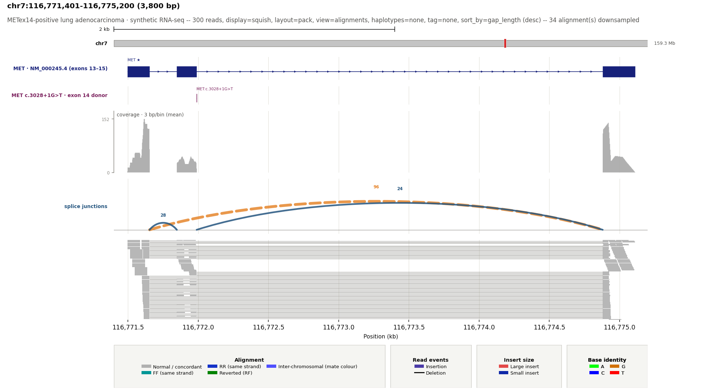</a><br>
      <strong>MET exon 14 skipping</strong><br>
      <sub>Splice-site VCF, gene model, RNA-seq coverage, sashimi arcs, and split reads.</sub>
    </td>
  </tr>
  <tr>
    <td width="50%">
      <a href="out/31_structural_variant_evidence.png">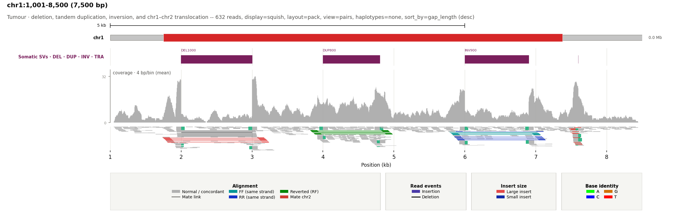</a><br>
      <strong>Structural-variant evidence</strong><br>
      <sub>Deletion, tandem duplication, inversion, and chr1–chr2 translocation with event-specific coverage, pair orientation, split reads, and soft clips.</sub>
    </td>
    <td width="50%">
      <a href="out/16_coverage_snv_vaf.png">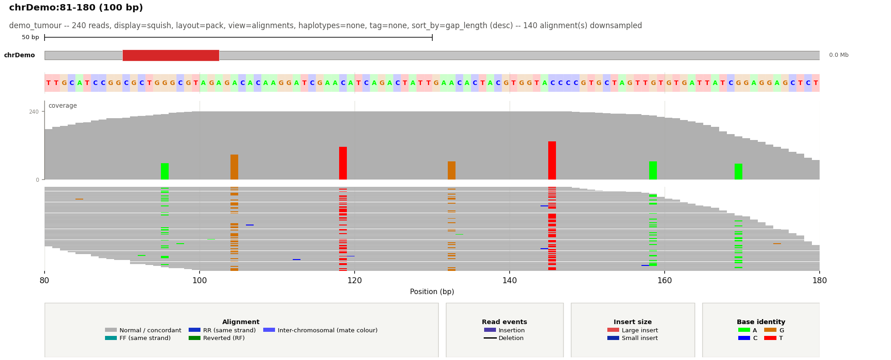</a><br>
      <strong>SNV allele fractions</strong><br>
      <sub>Coverage with strand-aware alternative-allele evidence and VAF labels.</sub>
    </td>
  </tr>
  <tr>
    <td width="50%">
      <a href="out/19_haplotype_split_view.png">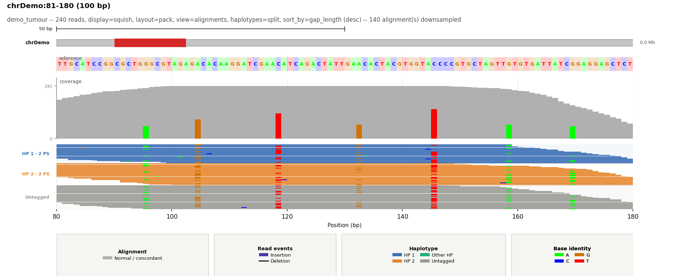</a><br>
      <strong>Phased haplotype lanes</strong><br>
      <sub>HP/PS-aware read colouring and lane separation.</sub>
    </td>
    <td width="50%">
      <a href="out/18_variant_evidence_baf_loh.png"></a><br>
      <strong>CNV with BAF/LOH and genomic bands</strong><br>
      <sub>Alternating coordinate bands align purity-aware CN1 loss (BAF 0.20/0.80), CN3 gain (BAF 0.36/0.64), and their matching depth shifts.</sub>
    </td>
  </tr>
  <tr>
    <td width="50%">
      <a href="out/26_chipseq_peaks_density.png">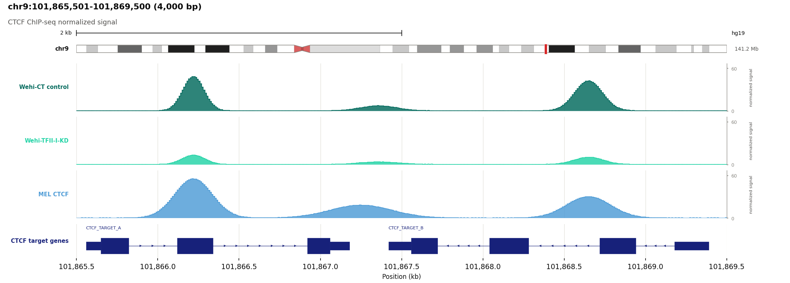</a><br>
      <strong>ChIP-seq signal profiles</strong><br>
      <sub>Track-only normalized signal comparison with gene annotations.</sub>
    </td>
    <td width="50%">
      <a href="out/27_multi_bam_vcf_companions.png">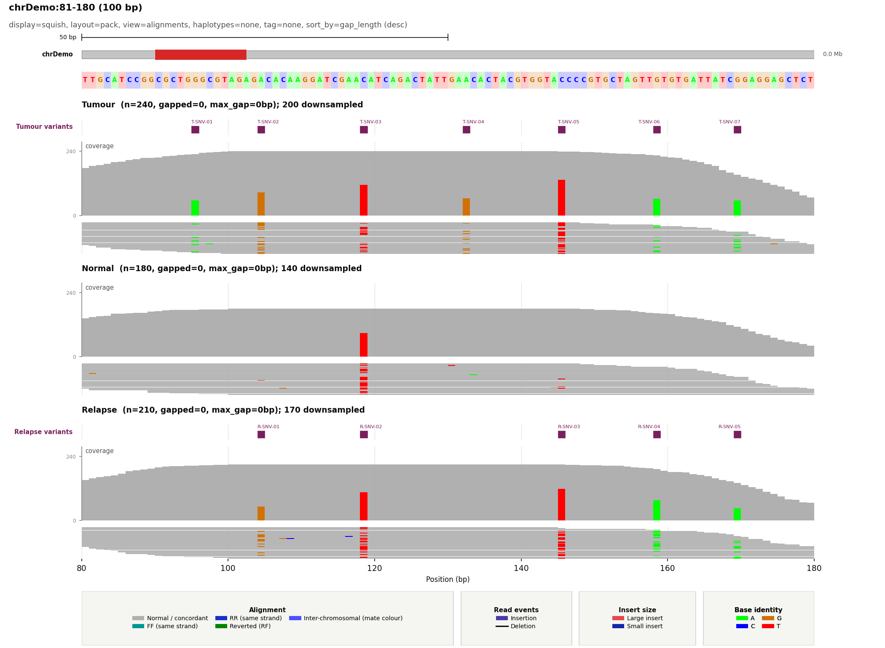</a><br>
      <strong>Multi-sample comparison</strong><br>
      <sub>Stacked BAM panels with sample-matched companion VCFs.</sub>
    </td>
  </tr>
  <tr>
    <td width="50%">
      <a href="out/15_view_as_pairs.png">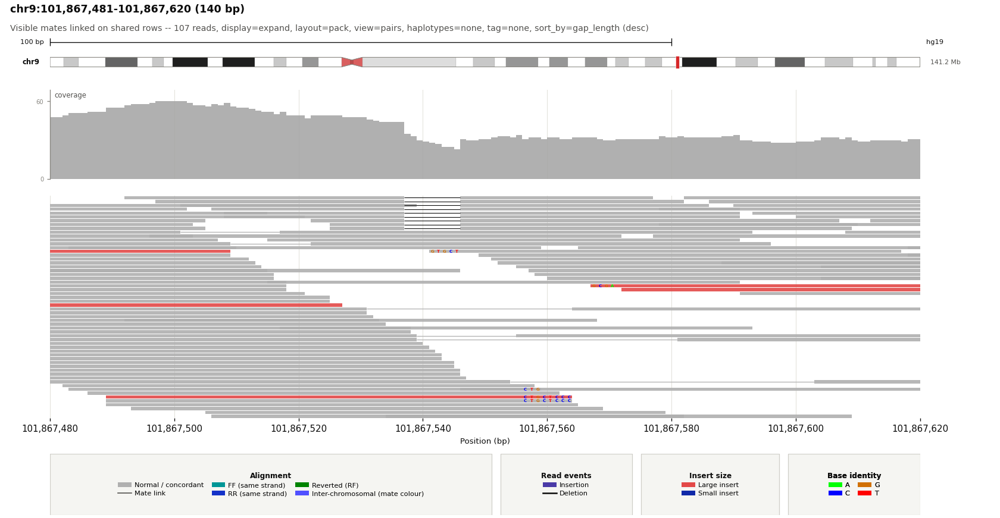</a><br>
      <strong>View as pairs</strong><br>
      <sub>Visible primary mates share rows and are connected across their genomic gap.</sub>
    </td>
    <td width="50%">
      <a href="out/06_mate_view_discordant.png">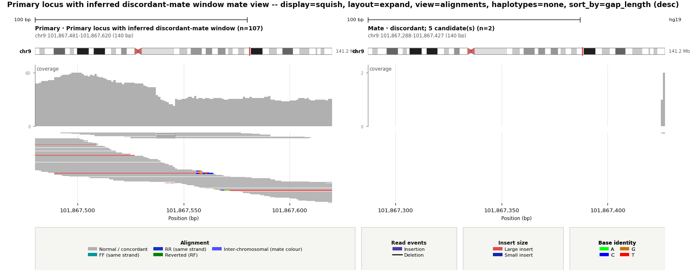</a><br>
      <strong>Two-locus mate window</strong><br>
      <sub>The requested locus is shown beside the automatically inferred discordant-mate region.</sub>
    </td>
  </tr>
  <tr>
    <td width="50%">
      <a href="out/22_sort_by_snv_base.png">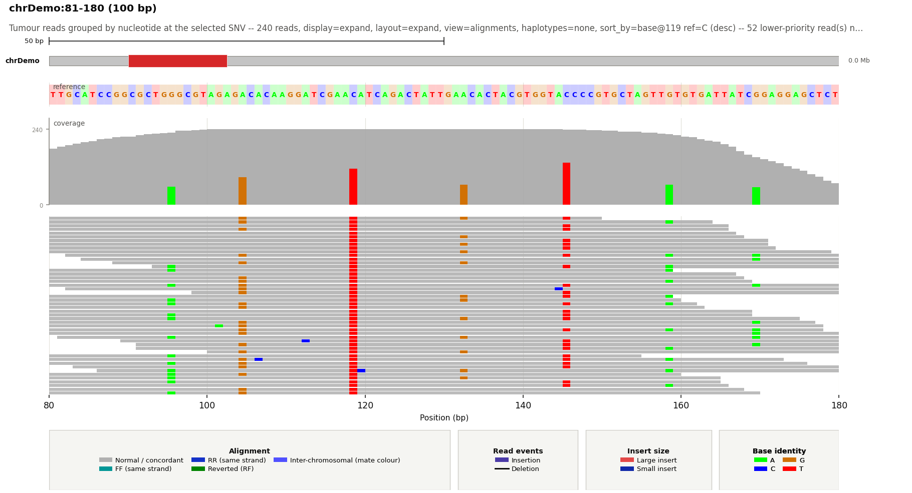</a><br>
      <strong>Sort by SNV base</strong><br>
      <sub>Alternative-allele reads are grouped and prioritized at the selected position.</sub>
    </td>
    <td width="50%">
      <a href="out/11_custom_track_definitions.png">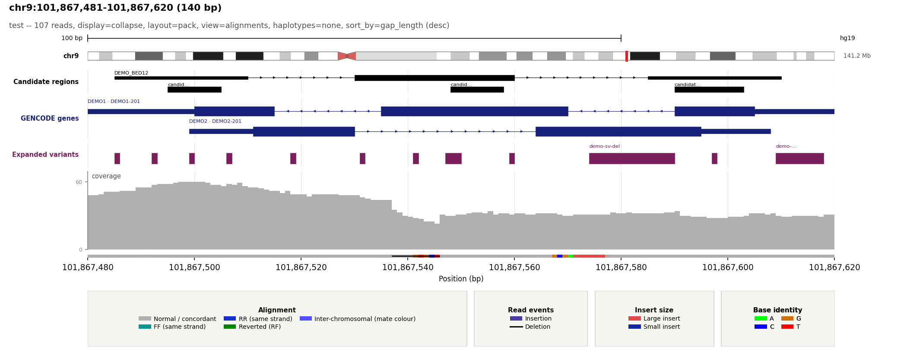</a><br>
      <strong>Mixed custom tracks</strong><br>
      <sub>BED regions, transcript models, and VCF variants are composed in one figure.</sub>
    </td>
  </tr>
  <tr>
    <td width="50%">
      <a href="out/32_close_zoom_softclipped_bases.png">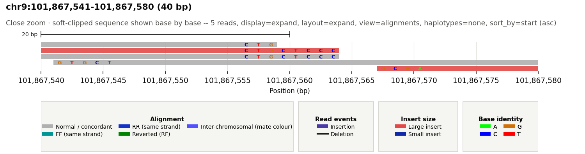</a><br>
      <strong>Soft-clipped bases at close zoom</strong><br>
      <sub>A 40 bp expanded view retains each read's background while colouring the clipped A/C/G/T letters like IGV.</sub>
    </td>
    <td width="50%">
      <a href="out/33_close_zoom_insertions.png">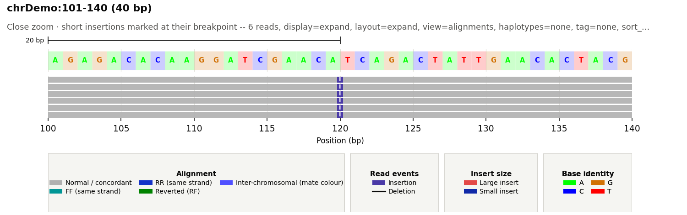</a><br>
      <strong>Insertions at close zoom</strong><br>
      <sub>Short CIGAR insertions appear as narrow purple breakpoint markers with a white I, matching IGV.</sub>
    </td>
  </tr>
</table>

The synthetic examples use expanded, deterministic datasets: 240 tumour, 180
normal, 210 relapse, 300 METex14 RNA alignments, 703 structural-variant
alignments, and 16,000 reads across a purity-aware CNV locus; 12 general VCF
records; 83 heterozygous BAF loci; 12 H3K27ac, 7 H3K27me3, and 24 DNase peaks;
and three 4 kb normalized CTCF signal profiles. DNA cohorts include a sparse
0.15% low-quality substitution-error model. The CNV cohort couples read depth,
SEG log2 ratios, and BAF bands for diploid, single-copy-loss/LOH, and three-copy
gain states. Rendered figures remain directly under `out/`; their generated
inputs are grouped by type:

```text
out/demo_data/
├── alignments/   # BAM and BAI
├── annotations/  # BED, GTF, SEG, and peak calls
├── config/       # Example YAML themes
├── reference/    # FASTA and FAI
├── signals/      # Quantitative signal tracks and indexes
└── variants/     # VCF and tabix indexes
```

Rebuild the demo inputs, indexes, and the twelve curated figures shown above
with:

```bash
bash regenerate_demo_examples.sh
```

## What you get by default

- chromosome ideogram with the current window marked in red
- RefSeq isoforms for recognized hg19/GRCh37 and hg38/GRCh38 BAMs
- Coverage and packed read alignments
- Automatic alignment downsampling above 100× depth
- Discordant-pair, indel, mismatch, and soft-clip colours


Add `--fasta reference.fa` to enable reference bases, mismatch detection, and
SNV allele fractions in coverage. A missing FASTA index is created when
possible.

## Pick the view you need

| Goal | Add these options |
|---|---|
| Normal IGV-like view | `--display_mode expand --layout pack` |
| Very deep region | `--display_mode squish --layout pack` |
| Overlay everything | `--display_mode collapse` |
| One sorted read per row | `--layout expand --sort_by gap_length` |
| Link visible mates | `--view_as_pairs` |
| Two loci: region + inferred mate locus | `--mate_view` |
| Only event-supporting reads | `--only discordant gapped split softclip` |
| Hide the legend | `--no_legend` |
| Hide the background grid | `--grid_mode none` |
| Add coordinate subdivisions | `--grid_mode major_minor` |
| Use alternating genomic bands | `--grid_mode bands` |
| Highlight a genomic interval | `--highlight chr1:100100-100250 --highlight_color '#ffd54f'` |
| Center the figure title | `--title_align center` |
| Hide coverage | `--no_coverage` |
| Hide chromosome overview | `--no_ideogram` |
| Add a center guide | `--center_guide` |

`display_mode` controls read height. `layout` controls row placement. They are
independent.

`--grid_mode` controls the genomic background consistently across alignment,
coverage, annotation, multi-sample, and mate-window panels. The default is
`major`. Grid colours, line styles, opacity, widths, band opacity, and the
number of minor subdivisions can all be adjusted under `visual_colors` and
`styles` in the YAML configuration.

Use repeatable `--highlight chrom:start-end` intervals to shade selected loci
through every data track. `--highlight_color` accepts Matplotlib colours and
`--highlight_alpha` controls their shared opacity. Highlights also work in
multi-sample and mate-window figures; in mate view, each interval is applied
only to the panel with the matching chromosome.

`--title_align left|center|right` positions the complete figure heading block,
including its subtitle. It applies consistently to single-locus, multi-sample,
and mate-window figures without moving individual track or panel labels.

## Common recipes

### Small window with reference bases

Reference bases are shown automatically for windows up to 250 bp.

```bash
locus-snap \
  --bam sample.bam \
  --fasta reference.fa \
  --region chr1:100001-100140 \
  --output_name base-detail
```

Change the limit with `--max_reference_span BP`; use `0` to hide the reference
row while keeping FASTA-backed mismatch detection.

### High-depth region

```bash
locus-snap \
  --bam deep.bam \
  --region chr1:100000-110000 \
  --display_mode squish \
  --layout pack \
  --max_alignment_depth 100 \
  --output_name deep-region
```

Coverage still uses all filtered reads. Only the displayed alignment track is
downsampled. Use `--max_alignment_depth 0` to disable downsampling or
`--max_rows N` to impose a hard row limit.

### View paired alignments

```bash
locus-snap \
  --bam sample.bam \
  --region chr9:101867481-101867620 \
  --view_as_pairs \
  --display_mode squish \
  --output_name paired-reads
```

Visible primary mates share a row and are connected. Off-window,
inter-chromosomal, supplementary, and incomplete pairs remain individual
alignments.

### Two-panel breakpoint or translocation view

```bash
locus-snap \
  --bam tumour.bam \
  --region chr3:187721000-187721500 \
  --mate_view \
  --mate_window_source discordant \
  --only discordant \
  --output_name breakpoint
```

`--mate_window_source` accepts:

- `discordant`: mapped mate positions from discordant pairs;
- `split`: supplementary positions from SA tags;
- `softclip`: mapped mates of soft-clipped reads.

Candidates are grouped by chromosome. The busiest chromosome is selected and
the panel is centered on the mean candidate position. Set its width with
`--mate_window_size BP`. Mate view currently accepts one BAM.

### Sort reads carrying an SNV

```bash
locus-snap \
  --bam sample.bam \
  --fasta reference.fa \
  --region chr9:101867520-101867570 \
  --layout expand \
  --sort_by base \
  --sort_base_position 101867542 \
  --output_name snv-sort
```

Alternative A/C/G/T alleles are placed first, followed by the reference,
deletions, skips, and reads that do not cover the position. Without a FASTA,
the most frequent observed base is used as the local reference.

### Show SNV allele fractions in coverage

```bash
locus-snap \
  --bam sample.bam \
  --fasta reference.fa \
  --region chr1:100001-100140 \
  --coverage_vaf_threshold 0.10 \
  --min_baseq 20 \
  --min_variant_mapq 20 \
  --show_variant_counts \
  --output_name vaf
```

The default threshold is VAF > 0.20. Only SNVs are included. Labels show
ALT/depth, VAF, strand counts, mean base quality, and mean MAPQ when there is
enough room.

### Haplotype-aware view

```bash
locus-snap \
  --bam phased.bam \
  --region chr1:100001-100500 \
  --haplotype_view split \
  --haplotype_filter 1 2 untagged \
  --output_name haplotypes
```

`color` colours reads by the `HP` tag. `split` also creates HP lanes and shows
phase-set information from `PS`. Override the tags with `--haplotype_tag` and
`--phase_set_tag`.

### RNA-seq sashimi view

```bash
locus-snap \
  --bam rnaseq.bam \
  --region chr1:100000-110000 \
  --sashimi \
  --min_junction_reads 3 \
  --sashimi_strand split \
  --display_mode squish \
  --output_name sashimi
```

Junctions come from CIGAR `N` operations. Arc labels are supporting-read
counts. `combined` merges strands; `split` mirrors plus and minus junctions.

### Stack several BAMs and matched VCFs

```bash
locus-snap \
  --bam tumour.bam \
  --bam normal.bam \
  --bam relapse.bam \
  --sample_label Tumour \
  --sample_label Normal \
  --sample_label Relapse \
  --vcf_companion tumour.vcf.gz \
  --vcf_companion none \
  --vcf_companion relapse.vcf.gz \
  --region chr9:101867492-101867612 \
  --output_name multi-sample
```

Repeat labels and companion VCFs in BAM order. Use `none` when a sample has no
VCF. Each BAM keeps its own coverage, alignments, downsampling, and summary.

## Add genomic tracks

The short form is enough when the filename identifies the format:

```bash
locus-snap \
  --bam sample.bam \
  --region chr9:101867492-101867612 \
  --track genes.gtf.gz \
  --track variants.vcf.gz \
  --track_label Genes \
  --track_label Variants \
  --output_name annotated
```

For full control, use one quoted CSV value per track:

```text
--custom_track 'FILE,TYPE,NAME,COLOR[,DISPLAY[,HEIGHT_IN]]'
```

Example:

```bash
--custom_track 'regions.bed,bed,Candidates,#000000,collapse,0.30' \
--custom_track 'genes.gtf.gz,gtf,GENCODE,#17217a,expand,0.85' \
--custom_track 'variants.vcf.gz,vcf,Variants,#7a1f5c,collapse,0.25'
```

Quote the entire value so `#` is not treated as a shell comment.

### Supported tracks

| Type | Use for | Default rendering |
|---|---|---|
| BED/BED12 | regions, probes, custom features | black blocks |
| GFF/GFF3/GTF | genes and transcripts | UCSC navy exon/UTR models |
| VCF | SNVs and structural variants | burgundy variant intervals |
| narrowPeak/broadPeak | ChIP-seq, ATAC-seq, DNase-seq | filled signal peaks |
| signal | normalized ChIP/ATAC/DNase pileup | continuous filled profile |
| SEG | segmented copy number | gain/loss log2 track |
| bedGraph/log2/CNV | binned or segmented log2 ratios | signed zero-centered track |

The accepted custom `TYPE` values are `bed`, `gff`, `gff3`, `gtf`, `vcf`,
`narrowpeak`, `broadpeak`, `peak`, `signal`, `seg`, `bedgraph`, `log2`, `cnv`,
and `auto`.

Use `--track_display` to control annotation density:

| Mode | Result |
|---|---|
| `collapse` | merge transcript isoforms into one model per gene |
| `pack` | preserve models and share non-overlapping rows |
| `expand` | one transcript per row |
| `density` | compact binned feature count |

Gene introns carry strand arrows: right for `+`, left for `-`. Exons are thick;
UTRs are thinner. Use `--primary_isoforms prefer` to select MANE Select,
RefSeq Select, Ensembl canonical, APPRIS principal, or another recognized
primary marker, while keeping all isoforms for genes without a marker. Use
`only` to remove genes without a primary marker; `all` is the default.
Packed and expanded gene models retain both identifiers in gene-first form,
for example `TGFBR1 · NM_004612.4`; collapsed models show the gene name only.

### Compressed tracks must be indexed

Plain-text tracks work directly. A `.gz`, `.bgz`, or `.bgzf` track must be
BGZF-compressed and have a `.tbi` or `.csi` index. It is fetched by region with
tabix; ordinary gzip is not enough.

```bash
bgzip genes.gtf
tabix -p gff genes.gtf.gz

bgzip regions.bed
tabix -p bed regions.bed.gz

bgzip variants.vcf
tabix -p vcf variants.vcf.gz

bgzip H3K27ac.narrowPeak
tabix -p bed H3K27ac.narrowPeak.gz
```

### ChIP-seq and accessibility

```bash
locus-snap \
  --bam sample.bam \
  --region chr1:100000-140000 \
  --track H3K27ac.narrowPeak.gz \
  --track_label H3K27ac \
  --custom_track 'H3K27me3.broadPeak,broadpeak,H3K27me3,#d95f02,collapse' \
  --custom_track 'DNase.narrowPeak.gz,narrowpeak,DNase,#2166ac,density' \
  --output_name chromatin
```

Peak-call files remain discrete intervals: height uses `signalValue`, then BED
score, and narrowPeak summits are marked. Four-column `signal` files are drawn
as one continuous filled pileup profile:

```bash
locus-snap \
  --bam sample.bam \
  --region chr1:100000-104000 \
  --custom_track 'control.signal.gz,signal,Control,#00695c,collapse' \
  --custom_track 'knockdown.signal.gz,signal,Knockdown,#22d3a6,collapse' \
  --no_alignments \
  --no_coverage \
  --output_name ctcf-signal
```

Set one shared `styles.signal_y_max` in YAML when comparing normalized samples;
`0` keeps automatic scaling. Use `density` when called intervals would otherwise
overplot.

### Copy number, BAF, and LOH

```bash
locus-snap \
  --bam tumour.bam \
  --region chr9:101000000-102000000 \
  --track tumour.seg \
  --track_label 'Tumour CNV' \
  --baf_vcf germline-snps.vcf.gz \
  --baf_sample Tumour \
  --baf_track_label 'Tumour BAF / LOH' \
  --output_name cnv-baf
```

BAF uses heterozygous biallelic SNVs. It prefers `FORMAT/AD` and falls back to
`FORMAT/AF`. Compressed VCF/BCF files require an index.

## Human references and ideograms

`--genome auto` identifies hg19 or hg38 only from exact chromosome lengths in
the BAM header. The ideogram uses bundled UCSC cytobands and spans the same
width as the genomic plot.

Useful controls:

```text
--genome hg19|grch37|hg38|grch38|none
--cytoband_file custom.cytoBand.txt.gz
--no_ideogram
```

`--refseq auto` similarly selects and caches an indexed NCBI RefSeq track.

```text
--refseq hg19|grch37|hg38|grch38|none
--refseq_dir /shared/refseq-cache
```

Pre-download both supported assemblies with:

```bash
python3 download_refseq.py
```

The fixed sources are NCBI Annotation Release 105.20220307 for
[GRCh37.p13](https://ftp.ncbi.nlm.nih.gov/genomes/all/annotation_releases/9606/105.20220307/GCF_000001405.25_GRCh37.p13/GCF_000001405.25_GRCh37.p13_genomic.gff.gz)
and Annotation Release 110 for
[GRCh38.p14](https://ftp.ncbi.nlm.nih.gov/genomes/all/annotation_releases/9606/110/GCF_000001405.40_GRCh38.p14/GCF_000001405.40_GRCh38.p14_genomic.gff.gz).

## Configure everything with YAML

Pass `--config FILE.yaml`. Command-line options override YAML preferences.

```yaml
preferences:
  display_mode: squish
  max_alignment_depth: 150
  primary_isoforms: prefer
  fig_width: 16
  dpi: 200

alignment_colors:
  normal: "#c8c8c8"
  large_insert: "#d73027"
  small_insert: "#4a3aa7"

track_colors:
  bed: "#000000"
  gene: "#17217a"
  vcf: "#7a1f5c"

styles:
  row_height_in: 0.06
  squish_row_height_in: 0.015
  coverage_track_height_in: 1.40
  annotation_row_height_in: 0.30
  alignment_edge_width: 0.00
  gene_arrow_size: 2.70
  gene_arrow_spacing_px: 24.0
```

See [config.example.yaml](config.example.yaml) for every colour, preference,
height, opacity, line width, legend setting, ideogram colour, and sashimi style.
Unknown keys and invalid values fail early.

Every track height is configurable:

| Track | YAML key |
|---|---|
| Alignments | `row_height_in`, `squish_row_height_in` |
| Coverage | `coverage_track_height_in` |
| BED/GFF/GTF/VCF | `annotation_row_height_in` |
| CNV | `cnv_track_height_in` |
| BAF/LOH | `baf_track_height_in` |
| Peaks/signal/density | `peak_track_height_in` |
| Sashimi | `sashimi_track_height_in` |
| Reference bases | `reference_height_in` |
| Ideogram | `ideogram_height_in` |

The sixth `--custom_track` CSV field overrides the height for one track.

## Output format and resolution

PNG is the default. Use a filename extension or `--output_format`:

```bash
# Editable vector image
locus-snap \
  --bam sample.bam --region chr1:100000-101000 \
  --output_name locus.svg

# High-resolution PNG
locus-snap \
  --bam sample.bam --region chr1:100000-101000 \
  --output_name locus --output_format png --fig_width 16 --dpi 300
```

Supported formats: PNG, SVG, SVGZ, PDF, JPEG, TIFF, and WebP. Raster width is
`fig_width × dpi`; height adapts to the tracks and read rows.

## Read colours and evidence

| Read appearance | Meaning |
|---|---|
| grey | normal/concordant |
| red | unexpectedly large FR insert |
| dark blue | unexpectedly small FR insert |
| purple | CIGAR insertion marker |
| teal / blue | FF/RR same-strand pair (IGV orientation colours) |
| green | everted RF pair |
| IGV chromosome colour | inter-chromosomal pair, keyed by the mate chromosome |
| lighter fill | lower MAPQ |

The expected insert-size range is estimated from eligible FR pairs in the
window. Disable pair colours with `--no_pair_colors`; disable MAPQ shading with
`--no_mapq_shading`.

CIGAR insertion and deletion lengths are hidden by default. Show them with
`--show_indel_lengths`.

## Options people use most

| Option | Purpose |
|---|---|
| `--bam BAM` | indexed input; repeat for multiple samples |
| `--region chr:start-end` | 1-based inclusive window |
| `--fasta FASTA` | reference bases, mismatches, and coverage VAF |
| `--flank BP` | add context on both sides |
| `--display_mode collapse\|expand\|squish` | read-track density |
| `--layout pack\|expand` | packed rows or one sorted unit per row |
| `--sort_by KEY` | `base`, `gap_length`, `mapq`, `start`, and more |
| `--only TYPE [...]` | keep discordant, gapped, split, or soft-clipped reads |
| `--no_legend` | hide legend cards and reclaim their space |
| `--grid_mode MODE` | `none`, `major`, `major_minor`, or alternating `bands` |
| `--highlight REGION` | shade a repeatable interval through every data track |
| `--highlight_color COLOR` | colour shared by highlighted intervals |
| `--highlight_alpha A` | highlight opacity in the range `(0, 1]` |
| `--title_align ALIGN` | place the figure title at `left`, `center`, or `right` |
| `--min_mapq N` | filter low-MAPQ reads |
| `--max_alignment_depth N` | downsample displayed reads above N×; default 100 |
| `--view_as_pairs` | link visible primary mates |
| `--mate_view` | add an inferred mate-locus panel |
| `--track PATH` | add a genomic track; repeatable |
| `--custom_track SPEC` | add a named, coloured, sized track |
| `--config YAML` | reusable defaults and styles |
| `--metrics_tsv PATH` | export per-read classifications and metrics |
| `--fig_width INCHES --dpi N` | output size and raster resolution |

Run this for the full option list:

```bash
locus-snap --help
```

## Test supported Python versions with Tox

Install the development tools and run the complete Python 3.9–3.14 matrix:

```bash
python3 -m pip install -e '.[dev]'
tox run
```

Tox creates isolated environments, builds and installs the package wheel, and
runs the complete pytest suite in each available interpreter. Missing local
interpreters are reported and skipped. Run one version or pass pytest options
after `--`:

```bash
tox run -e py312
tox run -e py310 -- -k highlight
```

When several interpreters are installed, run them concurrently with:

```bash
tox run-parallel --parallel all
```

## Performance: what happens on large windows

- Coverage is binned to the physical image width. Wide windows do not create
  one plotting object per base.
- Alignment display is downsampled above 100× by default. Coverage, summaries,
  sashimi counts, and TSV metrics still use the complete filtered cohort.
- Indexed tracks are fetched only for the requested region.
- Alternative alleles and discordant/gapped/split/soft-clipped evidence are
  prioritized during downsampling.

For a faster, smaller deep-region image, start with:

```text
--display_mode squish --layout pack --max_alignment_depth 100
```

Add `--max_rows 200` if the image is still too tall. Add `--only` when you need
event evidence rather than every read.

## Troubleshooting

### “The BAM has no index”

```bash
samtools index sample.bam
```

### A compressed track will not load

It must be BGZF, not ordinary gzip, and it needs `.tbi` or `.csi` beside it.
Recompress and index it with `bgzip` and `tabix`.

### Reference bases or mismatches are missing

Pass `--fasta reference.fa`. Check that FASTA and BAM chromosome names match
(`chr1` versus `1`) and that the window is no larger than
`--max_reference_span` for the visible base row.

### The automatic gene track is missing

Assembly detection requires exact hg19/GRCh37 or hg38/GRCh38 chromosome
lengths. Select explicitly with `--refseq hg19` or `--refseq hg38`. The first
download also needs network access. Use `--refseq none` to disable it.

### The image is too tall or uses too much memory

Use `--display_mode squish`, keep the default 100× downsampling, and set
`--max_rows`. For a targeted review, add `--only discordant gapped split
softclip`.

### Mate view cannot find a locus

Try another `--mate_window_source`, lower `--min_softclip`, or remove an
overly restrictive `--only` filter.

## Tests

```bash
pytest -q
```
